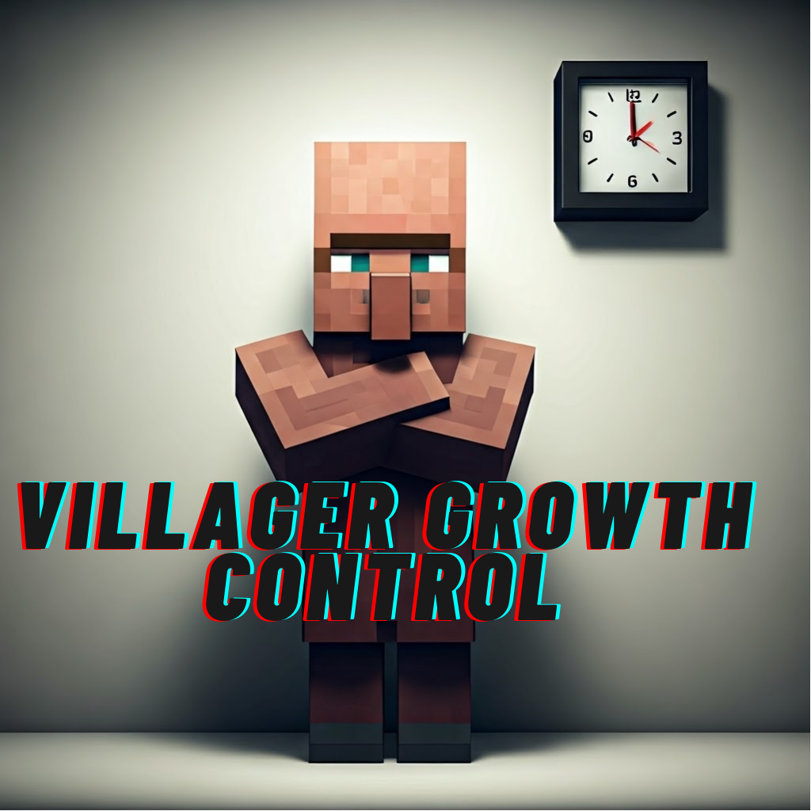

# **Villager Growth Control**
## _**By Shachar Tsrafati aka ShacharTs**_
### **Basic mod that add the option to modify baby villager grow cooldown**

**Commands**
======

1. **/villagergrowthcontrollist : Command list**
2. **/changevillagercooldown  : Change villager grow time**
3. **/checkvillagercooldown : Check villager grow time**
4. **/resetvillagercooldown : : Reset villager grow time to default**

# Found bug?, Mod outdated ?
### Contact me

* Email : Shachar.ts1@gmail.com
* Discord : ShacharTs

Special Thanks
=
[N4meless24 Discord](https://discord.com/invite/vuen7NYsCA) for choosing name

Eliot aka  __**"__eliot"**__ (Discord) for ideas
